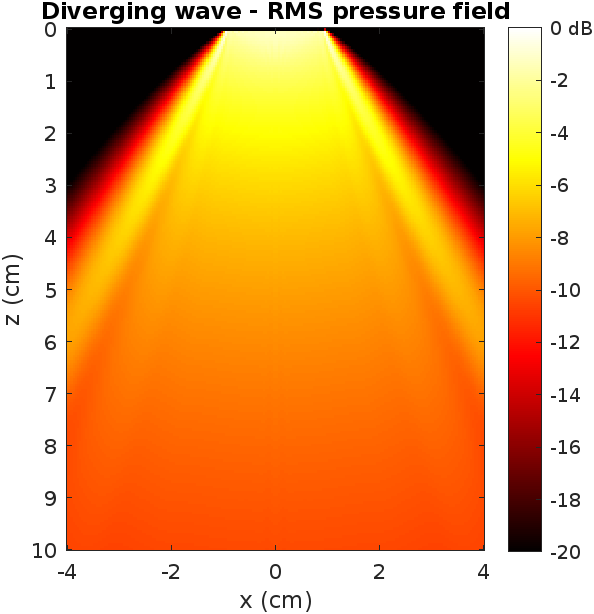

# Ultrasound Beam Simulation for Medical Imaging

This repository presents our work on ultrasound (US) beam simulation, with applications in medical imaging research. The project includes implementations in both **Python** (via the [PyMust](https://github.com/ulmangt/PyMust) library) and **MATLAB**, offering a comparative and educational resource for researchers and engineers in the field.

## Overview

Ultrasound beamforming is a key process in medical imaging. This project explores the simulation of beam patterns using ray-based modeling. The main goals are to:

- Simulate ultrasound beam propagation through different media.
- Visualize beam profiles using Python and MATLAB.
- Compare results between different implementations.

## Python Implementation

The `Python/Using_PyMust.ipynb` notebook contains:

- Setup and configuration of a simulation domain.
- Definition of physical parameters (sound speed, density, attenuation).
- Configuration of transducers and excitation.
- Visualization of beam patterns using `matplotlib`.

We use the [PyMust](https://github.com/ulmangt/PyMust) package, developed by the Ultrasound Lab at Montana State University.

## MATLAB Implementation

The MATLAB implementation replicates the same steps as in the Python notebook:

- Domain and grid setup.
- Ray tracing for beam simulation.
- Visualization of beam plots.

These scripts are located in the `matlab/` directory.

## Visualizations

Below are examples of the ultrasound beam profiles and delay configurations:

| Visualization | Description |
|---------------|-------------|
|  | Phased Array Probe. |
|  | Time delays applied to simulate beam steering. |
|  | Alternate configuration of transmit delays. |
|  | Focused beam at a single point in the simulation domain. |
|  | Configuration simulating multiple beam focus regions. |
|  | Delay profile associated with multiple focal points. |
|  | Example of a diverging beam simulation. |

